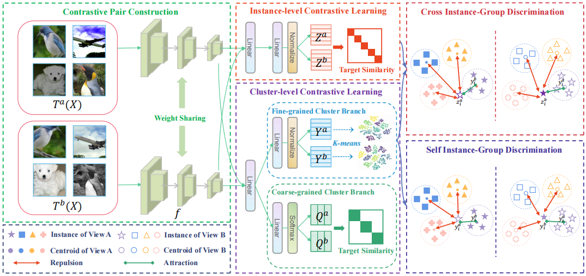

# Deep Clustering with Hybrid Contrastive and Discriminative Learning. (DCHL)

By Xiaozhi Deng, Ding-Hua Chen, Dong Huang, Bowen Zhu, Chang-Dong Wang and Jian-Huang Lai.

This is a Pytorch implementation of the paper.

## Performance

The representation encoder of the proposed SACC is ResNet34.

|    Dataset    | NMI  | ACC  | ARI  |
| :-----------: | :--: | :--: | :--: |
|   CIFAR-10    | 71.0 | 80.1 | 65.4 |
|   CIFAR-100   | 43.2 | 44.6 | 27.5 |
|    STL-10     | 72.6 | 82.1 | 68.0 |
| ImageNet-dogs | 49.5 | 51.1 | 35.9 |
| Tiny-ImageNet | 34.6 | 14.6 | 7.6  |

## Dependency

- python>=3.7
- pytorch>=1.6.0
- torchvision>=0.8.1
- munkres>=1.1.4
- numpy>=1.19.2
- opencv-python>=4.4.0.46
- pyyaml>=5.3.1
- scikit-learn>=0.23.2
- cudatoolkit>=11.0

## Configuration

There is a configuration file "config/config.yaml", where one can edit both the training and test options.

